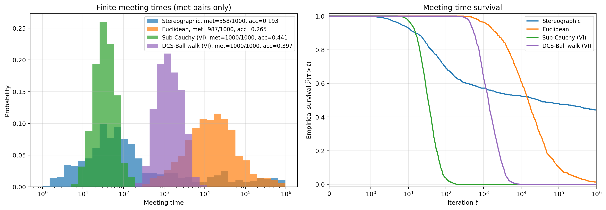

# Coupling heavy-tailed distributions

Reproducible maximal-reflection coupling experiments for a 100-dimensional skew-t target. The code compares sub-Cauchy sampling (SCS), DCS-Ball walk, stereographic sampling and Euclidean random-walk Metropolis using 1,000 common initial pairs and a meeting-time cutoff of 1,000,000 iterations.

SCS rejects proposals on the dark side directly, without stepping out. The target has degrees of freedom ν = 2, location zero, scale I and skewness (100, −100, 0, …, 0).

## Experiments

| Directory | SCS setup | DCS setup |
|---|---|---|
| [skew_t/vi_scs](skew_t/vi_scs/) | VI-fitted transformation, proposal h = 0.08 | VI-fitted transformation, γ/R = 0.14 |
| [skew_t/fixed_scs](skew_t/fixed_scs/) | Fixed transformation, proposal h = 0.15 | Same VI-fitted transformation, γ/R = 0.14 |

Each directory is self-contained, with code, initial states, frozen parameters, all 4,000 observations, summaries, validation results and the plotted figure. The `vi_scs` directory contains the latest comparison and a [methods paragraph and figure caption](skew_t/vi_scs/manuscript_text.md). All included data are synthetic simulation data.



## Setup and reproduce the figure

Use Python 3.12. The pinned requirements record the versions used for the saved experiment. For the accelerated stereographic rerun, a C++17 compiler is also required: Clang on macOS or g++ on Linux.

```sh
python -m venv .venv
source .venv/bin/activate
python -m pip install -r requirements.txt
python skew_t/vi_scs/plot_meeting_times.py
```

The plot is written into `skew_t/vi_scs/meeting_times_vi_1000.pdf` and `.png`. Plotting uses the saved observations and does not rerun MCMC. To plot the earlier SCS comparison:

```sh
python skew_t/fixed_scs/plot_meeting_times.py
```

## Refit and rerun SCS

The latest SCS procedure fits its horizontal observer, location and scalar scale, with latitude fixed at 1.1. It minimizes reverse KL using 4,000 Adam iterations and 2,048 Monte Carlo samples per iteration. Proposal size is tuned separately toward 40% stationary acceptance; all parameters are then frozen.

```sh
cd skew_t/vi_scs
python scs_vi_experiment.py --stage fit
python scs_vi_experiment.py --stage tune
python scs_vi_experiment.py --stage validate
python scs_vi_experiment.py --stage run
python summarize_results.py
python plot_meeting_times.py
```

The sampling runner resumes the saved `scs_vi_meeting_times.csv`. To generate new runs at the same settings, work in a fresh copy without that result file. For a saved-parameter run, omit `fit` and `tune`. Keep `previous_meeting_times.csv` as the input supplying the unchanged other three methods. See the [VI-SCS instructions](skew_t/vi_scs/README.md) for all parameter definitions and seeds.

## Rerun the other algorithms

The [fixed-SCS experiment](skew_t/fixed_scs/README.md) provides the shared target and coupling kernels, DCS fitting and tuning, batched SCS/DCS/Euclidean runners, and a C++ stereographic runner. Its full reproduction retains 100 archived pairs and computes the 900-pair extension. Temporary batch checkpoints and compiled binaries are not committed. The supplied final results allow immediate plotting without the longer baseline computations.

## Saved results

| Method | Meetings by the cutoff | Mean / restricted mean |
|---|---:|---:|
| SCS, fixed transformation | 1,000/1,000 | 16.203 |
| SCS, VI-fitted and acceptance-retuned | 1,000/1,000 | 40.876 |
| DCS-Ball walk, VI-fitted | 1,000/1,000 | 1,691.961 |
| Euclidean | 987/1,000 | 55,963.372 (restricted) |
| Stereographic | 558/1,000 | 458,504.412 (restricted) |

Restricted means average min(τ, 1,000,000), retaining censored observations. The histogram excludes censored pairs, while the survival panel retains them. The survival curve is not asserted to be a TV bound to stationarity for two nonstationary, zero-lag chains.

VI optimizes the transformed-density approximation rather than meeting time. This update changed both the SCS transformation and its step size. Acceptance values in the plot average paths stopped at meeting/censoring; the independently estimated stationary acceptance is about 40% for both VI-SCS and DCS. Detailed results and interpretation are in the experiment READMEs. Recorded runtimes from different backends should not be used as a computational-efficiency comparison.

## References

- Grazzi, Liu, Roberts and Yang, *Sub-Cauchy Sampling: Escaping the Dark Side of the Moon*, [arXiv:2601.11066](https://arxiv.org/abs/2601.11066), especially Section 3.
- Brešar and Mijatović, *Diffeomorphic Markov Chain Monte Carlo: fast mixing for heavy-tailed distributions*, [arXiv:2608.04284](https://arxiv.org/abs/2608.04284), especially Appendix D.

The DCS transformation is independently fitted on ν = 2; it is not a reproduction of unpublished fitted values from the reference's ν = 3 experiment. The repository documents the exact optimization and simulation choices used here.
