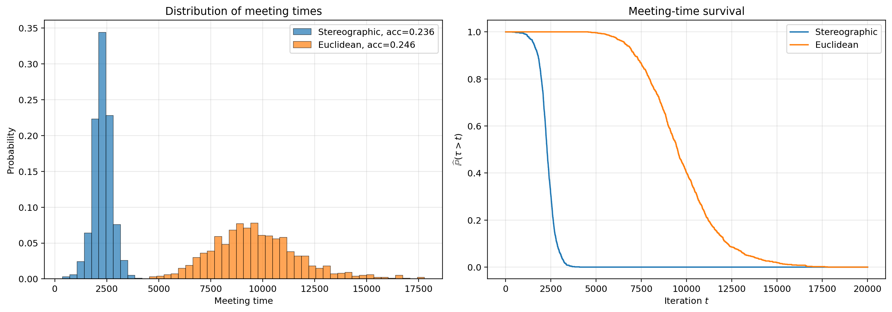

# Student's t regression: Section 5.2

Separate reimplementation of the supplied Boston Housing experiment, comparing stereographic and Euclidean maximal-reflection coupling. The original Python files and supplied script were read for verification and left unchanged. All 1,000 trials per method below are newly simulated; results were not copied from the original CSV files.



## Saved results

| Method | Meetings | Mean meeting time | Monte Carlo SE of mean | Median | 95% quantile | Acceptance |
|---|---:|---:|---:|---:|---:|---:|
| Stereographic | 1,000/1,000 | 2,293.805 | 14.220 | 2,285.0 | 3,056.35 | 23.5688% |
| Euclidean | 1,000/1,000 | 9,674.510 | 65.858 | 9,495.5 | 13,304.35 | 24.5656% |

The mean meeting time is about 4.22 times smaller for stereographic coupling. Both methods met before 20,000 iterations in every trial. These results reproduce the separation and approximately 23%-25% acceptance in the supplied draft's Figure 7. The proposal scales were taken from the supplied script and were not retuned to obtain these results.

## Target and settings

The model is `y_i = X_i beta + epsilon_i`, with independent Student's t errors, degrees of freedom `nu = 4`, flat prior on beta, and prior density proportional to `1/sigma^2` on sigma squared. In coordinates `theta = (beta, u)`, where `u = log(sigma)`, the log posterior up to an additive constant is

```text
log pi(beta,u) = -(nu+1)/2 * sum_i log(1 + (y_i-X_i beta)^2/(nu*exp(2u))) - n*u.
```

| Setting | Value |
|---|---|
| Dataset | Supplied `BostonHousing.csv`, 506 observations |
| Predictors | All 13 columns other than `medv`; no added intercept |
| Preprocessing | Each predictor and response standardized using population standard deviation (`ddof=0`), exactly matching `StandardScaler` |
| Parameter dimension | 14: 13 coefficients and log scale |
| Stereographic center and radius | 0 and `sqrt(14)` |
| Stereographic proposal SD | 0.007, ambient Gaussian projected onto the tangent space, then normalized |
| Euclidean proposal SD | 0.03, isotropic Gaussian |
| Initial states | Two independent `N(0, 100 I_14)` states per replicate; the same pair for both methods |
| Trials | 1,000 per method |
| Iterations | 20,000 per trial, including after meeting |
| Meeting threshold | Euclidean distance at most `1e-12` in the original parameter coordinates |
| Acceptance | Actual MH decisions over all 20,000 iterations, averaged over both chains and all trials |

`configuration.json` records all settings and random seeds; `initial_states.npz` stores the actual common initial pairs. `standardization.json` records feature names, means and scales. `BostonHousing.csv` is an unchanged copy of the public benchmark data supplied for this experiment; its SHA-256 is recorded in the configuration. The original unpublished draft itself is not included.

## Implementation and comparison with the original

`regression_coupling.py` provides readable NumPy target, projection, proposal and MH reference functions. `regression_native.cpp` implements the same calculation efficiently, called through Python's `ctypes`; it is compiled automatically by the runner. No original sampler modules or `geomstats` installation are needed to run this rewrite.

On the unit sphere, the proposal log density at `p` from `z` is, up to a common constant,

```text
-(d+1)*log(z.p) - ((z.p)^(-2)-1)/(2*h^2),  if z.p > 0,
-infinity,                                otherwise.
```

After the maximal overlap test, reflecting `p` through the hyperplane perpendicular to `z1-z2` gives the second proposal. This is algebraically the reflection-plus-great-circle-rotation construction in the supplied sampler. The transformed log target is `log pi(R*z[:-1]/(1-z[-1])) - d*log(1-z[-1])`, up to a constant. Both chains use a common uniform variate for MH acceptance.

The new implementation uses a stable log-posterior calculation for extreme log scales, tests MH acceptance directly instead of `allclose`, assigns common proposals identically, and keeps coalesced chains together. It continues sampling to iteration 20,000 so the reported acceptance window matches the supplied script. Only summary counts are stored, avoiding full trajectory allocation.

Initial pairs are generated up front with NumPy `RandomState(42)`. This preserves the original initial distribution and first pair, but changes subsequent realized pairs relative to the original interleaved random stream. Each transition run has its own recorded seed, derived with SplitMix64; the native engine is `mt19937_64`. Consequently this is a new Monte Carlo replication, not a bit-for-bit replay. The C++ standard library's normal generator can also differ across platforms; the saved results and initial pairs provide the exact reported artifact.

`meeting_times.csv` records the one-based update count: a first-step meeting has time 1. `original_format_results.csv` uses the supplied script's columns and zero-based indices, so its meeting times are exactly one less. A value of `-1` in the canonical file means right-censored; the compatibility file uses `inf`. All saved trials met, and the distance-threshold and exact-equality meeting times coincide.

The right panel retains all trials in the empirical survival probability `P(tau > t)`. For two chains initialized from the same nonstationary distribution at zero lag, this plot by itself does **not** justify a total-variation bound to stationarity. It is therefore labeled "Meeting-time survival". The 14 x 5 inch layout, shared 50 linear histogram bins, colors, transparency and grids follow the supplied plotting code.

## Reproduce

The saved run used Python 3.13.0, NumPy 2.3.2 and Matplotlib 3.10.8. Python 3.10 or later and a C++17 compiler (Clang on macOS or g++ on Linux) are required for sampling; only the two Python dependencies are needed for plotting.

From this directory:

```sh
python -m venv .venv
source .venv/bin/activate
python -m pip install -r requirements.txt
python plot_results.py
```

This recreates the PNG/PDF figure, summary tables and original-format CSV from the saved results. To validate the native backend and run a fresh 1,000-replicate experiment without overwriting the saved results:

```sh
python validate_implementation.py
python run_experiment.py --workers 4 --output rerun
python plot_results.py --input rerun
```

The runner resumes completed `(method, replicate)` rows in its output folder. A bare `python run_experiment.py` uses the already completed saved results. Use a fresh output folder to recompute. A short pilot can use `--repetitions 8 --output pilot`. Temporary compiled libraries are excluded from version control.

## Validation

- Stable and direct log posterior formulas agree within `8.8e-11`; native/reference steps agree within `1.8e-15` in the deterministic test suite, with all 1,200 acceptance/overlap decisions matching.
- Independently compared 250 proposal-and-acceptance cases per method against the user's unchanged sampler modules, with maximum discrepancies below `1.8e-15`. Standardization matched `StandardScaler` exactly. This audit is recorded in `original_equivalence.json` with hashes of the input sources; it requires the user's separate modules to repeat.
- Projection round trips, unit sphere norms, extreme log scales and preservation of coalescence passed. See `validation.json` and the portable validation script.
- All 2,000 final records are unique, use 20,000 iterations, have finite proposal targets and satisfy exact meeting. Input files were checked unchanged by SHA-256 after the work.

`SHA256SUMS` covers every published file in this experiment except itself. `runtime.json` records the execution environment; elapsed time is not used to claim a cross-implementation speed comparison.
